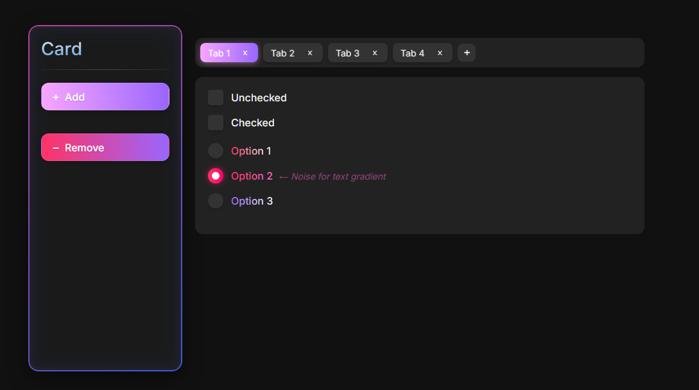

# LousyUI V1

A clean, modern UI component library featuring cards, tabs, form controls, and interactive elements.

## Features

- **Card Component**: Clean card design with action buttons
- **Tab System**: Interactive tabs with close functionality
- **Form Controls**:
  - Custom-styled checkboxes
  - Custom-styled radio buttons with gradient text
- **Responsive Design**: Works on various screen sizes

## Preview



## Installation

Simply include the following files in your project:
- `index.html` - Main HTML structure
- `styles.css` - All styling
- `script.js` - Interactive functionality

## Usage

1. **Card Component**:
```html
<div class="card">
    <h2 class="card-title">Card Title</h2>
    <div class="divider"></div>
    <div class="button-container">
        <button type="button" class="btn add-btn">
            <span class="icon">+</span>
            <span class="text">Add</span>
        </button>
        <button type="button" class="btn remove-btn">
            <span class="icon">−</span>
            <span class="text">Remove</span>
        </button>
    </div>
</div>
```

2. **Tabs**:
```html
<div class="tabs-container">
    <div class="tabs-wrapper">
        <div class="tab active">
            <span class="tab-text">Tab 1</span>
            <button type="button" class="tab-close">×</button>
        </div>
        <!-- Additional tabs -->
        <button type="button" class="add-tab">+</button>
    </div>
</div>
```

3. **Form Controls**:
```html
<!-- Checkbox -->
<label class="custom-checkbox">
    <input type="checkbox" class="checkbox-input">
    <span class="checkbox-box"></span>
    <span class="checkbox-label">Option</span>
</label>

<!-- Radio Button -->
<label class="custom-radio">
    <input type="radio" name="options" class="radio-input">
    <span class="radio-circle"></span>
    <span class="radio-label">Option</span>
</label>
```

## License

MIT